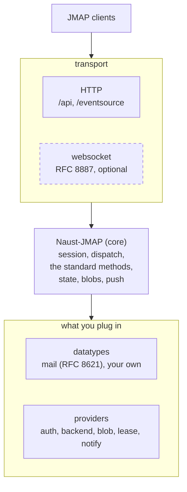

<div align="center">

# naust-jmap

**The Go framework for building JMAP servers.**

Build production JMAP servers with RFC 8620 (Core), RFC 8621 (Mail), and more with\
pluggable storage, authentication, search, and delivery. Stdlib-only core.

[](LICENSE)
[](https://go.dev/)
[](https://github.com/naust-mail/naust-jmap/actions/workflows/ci.yml)
[](https://pkg.go.dev/github.com/naust-mail/naust-jmap/core)

</div>

---

Build complete JMAP servers without implementing the protocol yourself.

naust-jmap has no opinion about anything the RFCs are silent on. You supply
object types, storage, authentication, search, and delivery through small
interfaces; the runtime supplies protocol correctness: the session resource,
request dispatch, standard method semantics, change tracking, state strings,
and push.

- **Datatypes are data, not code.** Describe a type once and the runtime derives
  its `/get`, `/changes`, `/set`, `/copy`, `/query` and `/queryChanges` methods.
- **Protocol-complete.** RFC 8620 end to end: session resource, batched requests,
  back-references, the full error catalog, blobs, and push.
- **Bring your own infrastructure.** Storage, authentication, blob persistence,
  leases, notifications and search are small interfaces with working defaults.
- **No dependencies in `core`.** Standard library only, forever. Anything needing
  third-party code is a separate module, so you import only what you use.
- **The runtime owns correctness.** Plugins own meaning. Backends own persistence.
- **One node or a fleet.** SQLite for a single process, Postgres with cross-
  instance leases and push for several.
- **Mail included.** `datatypes/mail` implements RFC 8621 - reading, composing,
  sending, and delivery over LMTP or HTTP ingest, and a tracked RFC compliance matrix.



`core` is the only required import. Everything below it is an interface with a
working in-process default, and everything beside it is a module you take only
if you want it - unimported code is absent from the binary and from the
dependency graph.

## Table of contents

- [Get started](#get-started)
  - [1. Install](#1-install)
  - [2. Run a server](#2-run-a-server)
- [Documentation](#documentation)
- [Usage examples](#usage-examples)
  - [Define a datatype](#define-a-datatype)
  - [Serve mail](#serve-mail)
  - [Choose persistence](#choose-persistence)
  - [Add the WebSocket transport](#add-the-websocket-transport)
- [Layout](#layout)
- [JMAP support](#jmap-support)
- [Mail (RFC 8621)](#mail-rfc-8621)
- [Roadmap](#roadmap)
- [License](#license)

## Get started

### 1. Install

The runtime is the only required module:

```sh
go get github.com/naust-mail/naust-jmap/core
```

Add what you actually serve. Each is its own module, and an unimported module
never enters your binary or your dependency graph:

```sh
go get github.com/naust-mail/naust-jmap/datatypes/mail          # RFC 8621 mail
go get github.com/naust-mail/naust-jmap/drivers/sqlite          # single-node storage
go get github.com/naust-mail/naust-jmap/drivers/postgres        # fleet storage
go get github.com/naust-mail/naust-jmap/capabilities/websocket  # RFC 8887 transport
```

> `core` and `capabilities/websocket` build on Go 1.24. `datatypes/mail`, both
> drivers and the examples require **Go 1.25**.

### 2. Run a server

```sh
git clone https://github.com/naust-mail/naust-jmap
cd naust-jmap
go run ./examples/quickstart
```

Then speak JMAP to it (user `demo@example.com`, password `demo`):

```sh
curl -su demo@example.com:demo http://localhost:8080/.well-known/jmap
```

[`examples/quickstart`](examples/quickstart) has the full request: it creates a
record, queries for it, and fetches it via a back-reference in one round trip.

## Documentation

Each module documents its own public API; the package documentation is the API
reference; the site covers tasks. Nothing is duplicated across the three.

| You want                                  | Look in                                                                                                                                                                                                   |
|-------------------------------------------|-----------------------------------------------------------------------------------------------------------------------------------------------------------------------------------------------------------|
| What a module provides and its public API | That module's README - [`core`](core), [`datatypes/mail`](datatypes/mail), [`drivers/sqlite`](drivers/sqlite), [`drivers/postgres`](drivers/postgres), [`capabilities/websocket`](capabilities/websocket) |
| The API reference                         | [pkg.go.dev](https://pkg.go.dev/github.com/naust-mail/naust-jmap/core)                                                                                                                                    |
| Working code                              | [`examples/`](examples) - quickstart, a full mail server, a two-instance cluster proof                                                                                                                    |
| How to accomplish a task                  | [naust.email/naust-jmap](https://naust.email/naust-jmap) - quickstart, auth, mail, websocket, fleet, reference                                                                                            |
| Method-by-method RFC status               | [reference matrices](https://naust.email/naust-jmap/reference)                                                                                                                                            |
| Reporting a vulnerability                 | [SECURITY.md](.github/SECURITY.md), [HARDENING.md](.github/HARDENING.md)                                                                                                                                  |

## Usage examples

Error handling is elided for brevity; the linked files check every call.

### Define a datatype

Describe it, register it, and the six standard methods exist. No method code:

```go
// Define a type with two properties, one indexed and one with a default value
todo := &descriptor.Type{
    Name:       "Todo",
    Capability: "urn:example:todo",
    Properties: map[string]descriptor.Property{
        "title": {Kind: descriptor.KindString, Indexed: true},
        "done":  {Kind: descriptor.KindBool, Indexed: true, Default: json.RawMessage(`false`)},
    },
}

// Register it with the runtime, which derives the standard methods
proc := runtime.NewProcessor()
core := runtime.DefaultCoreCapabilities()
runtime.RegisterStandardType(proc, db, todo, core)

// Serve it over HTTP
srv, _ := runtime.NewServer(users, proc, "http://localhost:8080", core)
srv.Capability("urn:example:todo").Advertise(struct{}{}, struct{}{})
http.ListenAndServe("localhost:8080", srv)
```

Full file: [`examples/quickstart`](examples/quickstart).

### Serve mail

The RFC 8621 types register the same way, into the same processor. Delivery
and submission are their own packages, `datatypes/mail/deliver` and
`datatypes/mail/submit`, imported only when you need them:

```go
// Register the five RFC 8621 (mail) types. Each takes a config struct;
// RegisterEmail takes its search implementation explicitly - here the
// built-in substring search.
mail.RegisterMailbox(proc, mail.MailboxConfig{DB: db, Core: core})
mail.RegisterThread(proc, mail.ThreadConfig{DB: db, Core: core})
mail.RegisterEmail(proc, mail.EmailConfig{
    DB: db, Store: blobs, Core: core,
    AccountCapability: mail.DefaultAccountCapability(),
    Searcher:          search.New(blobs),
})
mail.RegisterIdentity(proc, mail.IdentityConfig{DB: db, Core: core, Policy: policy})

// submit.Register returns the submission queue a sending worker reads.
// A nil Limits means submit.DefaultLimits().
queue, _ := submit.Register(proc, submit.Config{DB: db, Store: blobs, Core: core, Policy: policy})
```

Full file: [`examples/mailserver`](examples/mailserver), which also wires LMTP
and HTTP ingest so mail can actually arrive.

### Choose persistence

Storage is two lines, and nothing above them changes:

```go
// Pick one backend:
store, _ := sqlite.Open("./naust-mail.db")        // single process
// store, _ := postgres.Open(ctx, "postgres://...")  // several processes

db := objectdb.New(store, lease.NewInProcess(store))
blobs, _ := chunkstore.New(store)                 // one of three blob stores
```

See [choosing a blob store](core#choosing-a-blob-store), and
[`examples/cluster`](examples/cluster) for what changes with more than one node.

Neither driver fits? A backend is four methods over an ordered key-value store,
and [`drivers/`](drivers) is the guide to writing one.

### Add the WebSocket transport

Requests and push on one connection instead of `/api` plus `/eventsource`:

```go
ws := websocket.NewHandler(srv, users)
srv.Capability(websocket.CapabilityURI).
    Advertise(websocket.SessionCapability(srv.BaseURL(), "/ws", ws.SupportsPush()), struct{}{})
mux.Handle("/ws", ws)
```

Full module: [`capabilities/websocket`](capabilities/websocket).

## Layout

One module per component. Drivers implement providers. Datatypes consume the
runtime.

| Directory               | What lives there                                                                                                                                                              | You...                    |
|-------------------------|-------------------------------------------------------------------------------------------------------------------------------------------------------------------------------|---------------------------|
| [`core/`](core)         | The runtime library, one Go module, stdlib-only forever                                                                                                                       | import always             |
| `core/providers/`       | The interfaces the runtime needs (storage, blobs, leases, notifications, auth), each with a built-in in-process implementation                                                | pick or implement         |
| [`drivers/`](drivers)   | Provider implementations that need third-party dependencies ([sqlite](drivers/sqlite), [postgres](drivers/postgres)), each its own module - and the guide to writing your own | import at most one or two |
| `datatypes/`            | JMAP datatypes served on top of the runtime ([mail](datatypes/mail) arrives here first), each its own module                                                                  | import what you serve     |
| `capabilities/`         | Optional protocol capabilities beside the core endpoints (the RFC 8887 [WebSocket](capabilities/websocket) transport first), each its own module                              | import what you want      |
| [`examples/`](examples) | Runnable servers: the quickstart above, a full mail server, and a two-instance cluster proof                                                                                  | read                      |

## JMAP support

The core protocol (RFC 8620) is implemented end to end:

- The core protocol: session resource, request envelope, back-references,
  capability gating, request limits, strict I-JSON.
- The RFC derived standard methods over any registered datatype: `/get`,
  `/changes`, `/set`, `/copy`, `/query`, `/queryChanges`.
- Binary data (`Server.EnableBlobs`): streaming upload/download endpoints and
  `Blob/copy`, with reference tracking and unreferenced-blob sweeping. Three blob
  stores ship, all behind `blob.Store` (see [choosing one](core#choosing-a-blob-store)).
- Push (`Server.EnablePush`): the event-source endpoint, plus verified
  `PushSubscription` webhooks with RFC 8291 encryption when given a
  subscription store and sender.
- JMAP over WebSocket (RFC 8887): the optional, stdlib-only
  `capabilities/websocket` module, sharing `maxConcurrentRequests` with
  the HTTP endpoint and adding StateChange push over the socket.

The [`core/` README](core#protocol-support) carries the full RFC 8620 support
matrix and the runtime's recorded design decisions; [`datatypes/mail`](datatypes/mail#design-decisions)
carries the mail ones.

## Mail (RFC 8621)

The first datatype module, [`datatypes/mail`](datatypes/mail), implements RFC
8621: Mailbox, Thread, Email, Identity and EmailSubmission as descriptor types
over the derived RFC 8620 machinery, plus message delivery through LMTP and
HTTP ingest adapters and a sending worker. Its README carries the public API,
the RFC 8621 support matrix, and the calls the module makes where the spec is
silent.

A complete, persistent mail server - the sqlite driver, all five types, both
delivery adapters, sending, and push - is in
[`examples/mailserver`](examples/mailserver):

```sh
go run ./examples/mailserver
```

## Roadmap

naust-jmap is pre-release (pre-1.0): modules version independently and
breaking changes may still land in minor bumps. The mail module (see Mail
above) reads, composes and sends, over either the sqlite or postgres driver
(the latter including a multi-node cluster hint layer). Coming next, in
order:

- MDN send/parse (RFC 9007), S/MIME verification, and quotas as further
  RFC 8621-family modules

## License

<div align="center">

Released under the [Apache-2.0](LICENSE) license. See also [NOTICE](NOTICE).

</div>
